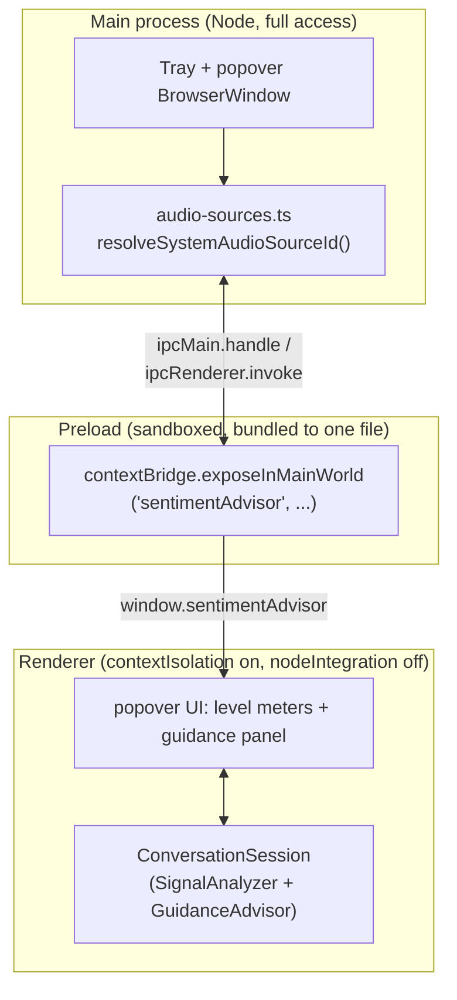
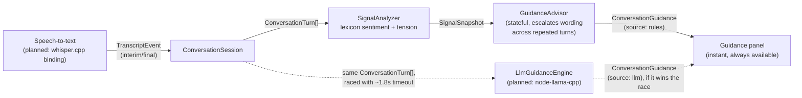

# Architecture

## Process layout

Standard Electron three-process split, kept as narrow as possible at the boundaries:

The preload script imports from `src/shared/` (e.g. `ipc-contract.ts`), but Electron's default sandboxed preload can only `require` a small built-in whitelist — it cannot resolve a relative `require` to another local module. Both `preload.ts` and `renderer.ts` are bundled into a single dependency-free file with esbuild at build time (see `package.json`'s `build` script) rather than disabling the sandbox. This was a real bug caught by `tests/e2e/start-listening.test.ts`: before the bundling step existed, the preload's import silently failed at runtime and `window.sentimentAdvisor` was `undefined` on every launch.

## Guidance engine

`src/shared/guidance/` is pure TypeScript with zero platform dependency — no Electron, DOM, or Node API — so it is unit-testable in plain Node and identical on all three target OSes.

- **`SignalAnalyzer`** scores each turn against a small fixed lexicon (no ML, no network call), aggregates over a rolling window of the last 8 turns, and combines interruption rate, speaking pace, and pause length into a tension score.
- **`GuidanceAdvisor`** maps `(sentiment, tension, unansweredQuestion)` to one of a handful of categories and a canned suggestion. It is *stateful*: it tracks how many consecutive turns the same category has held and escalates its wording instead of repeating itself — e.g. "Acknowledge the frustration out loud..." on the first urgent turn becomes "Still critical after 3 turns — naming an apology again won't land twice..." if the situation persists.
- **`ConversationSession`** is the orchestrator: turns interim/final `TranscriptEvent`s into `ConversationTurn`s, runs the two pieces above on every finalized turn, and — if an `LlmGuidanceEngine` is attached — races it against a generation counter so a slow or stale LLM response can never overwrite guidance for a newer turn, and can never block the instant rule-based result.

This design, and the two conversation fixtures it's validated against (a de-escalating customer-support call and an escalating HR warning — see `tests/fixtures/conversation-scenarios.ts`), is covered by `tests/unit/conversation-scenarios.test.ts` (algorithm correctness) and `tests/e2e/conversation-scenarios.test.ts` (same fixtures, replayed through the real UI over CDP).

## Planned: local-LLM upgrade

No concrete `LlmGuidanceEngine` exists yet — until one is attached, every session runs on the rule-based path alone, which is a fully supported permanent mode, not a degraded fallback. The planned implementation:

- **`node-llama-cpp`**, running a small instruct model in-process (no external server, no Ollama, no network call) — the same on-device, no-cloud guarantee as the rest of the app.
- **Grammar-constrained (GBNF) JSON output** — `{"sentiment": ..., "tension": ..., "guidance": ...}` with the string length capped in the grammar itself — so a small model's output is reliably parseable without trusting free-text obedience.
- **Raced against a ~1.8s hard timeout**, per turn, via the same `generation`-counter mechanism already implemented in `ConversationSession`. The rule-based guidance is the hard latency guarantee; the LLM only ever *upgrades* it when it lands in time.
- **Consent-gated model download** with progress and integrity verification, matching the app's on-device-only, nothing-leaves-the-machine positioning.
- The UI already renders a `source` tag (`rules` vs `llm`) on every guidance card, wired and tested now, ahead of there being an LLM to tag.

## Audio capture

- **Microphone**: plain `navigator.mediaDevices.getUserMedia({ audio: true })` in the renderer — no native audio module needed.
- **System/"remote" audio**: Electron's `desktopCapturer` + a `chromeMediaSourceId` constraint on `getUserMedia`, gated behind screen-recording permission on macOS. This needs no third-party virtual audio driver on macOS 13+ or Windows — see `src/main/audio-sources.ts`. Linux support is expected to be weaker (compositor/PulseAudio-dependent) and may need a manual monitor-source fallback later.
- **Speech-to-text**: not yet wired in. A whisper.cpp Node binding is planned; which one (`whisper-node` / `nodejs-whisper` / `smart-whisper` / Transformers.js's ONNX Whisper) is not yet decided.
