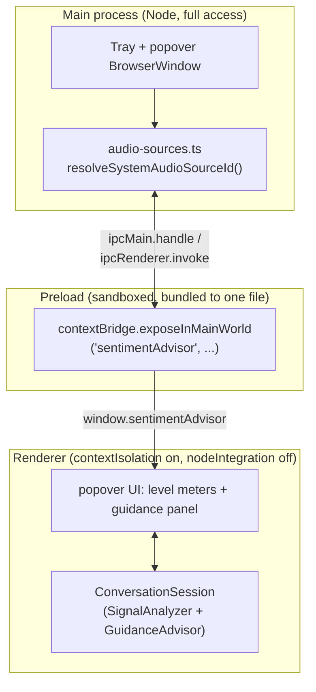
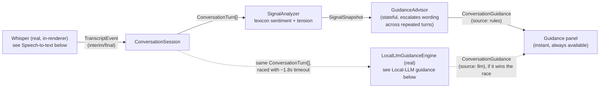
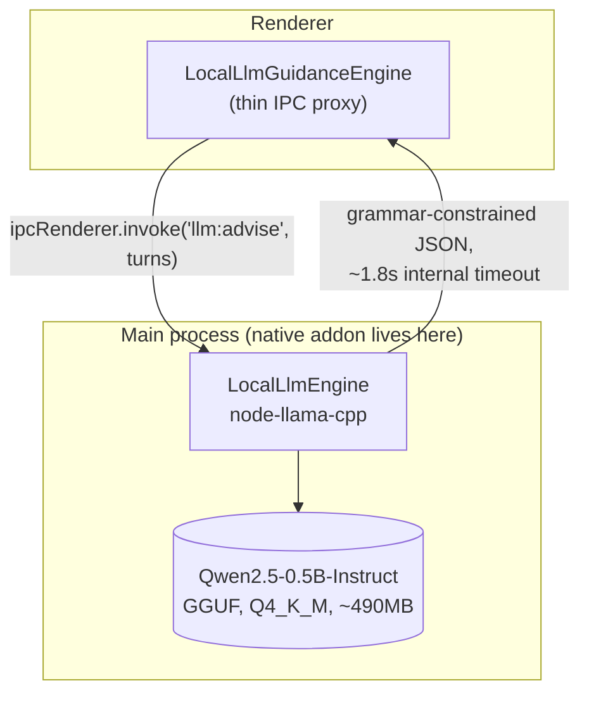
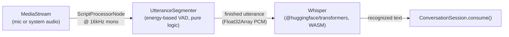

# Architecture

## Process layout

Standard Electron three-process split, kept as narrow as possible at the boundaries:

The preload script imports from `src/shared/` (e.g. `ipc-contract.ts`), but Electron's default sandboxed preload can only `require` a small built-in whitelist — it cannot resolve a relative `require` to another local module. Both `preload.ts` and `renderer.ts` are bundled into a single dependency-free file with esbuild at build time (see `package.json`'s `build` script) rather than disabling the sandbox. This was a real bug caught by `tests/e2e/start-listening.test.ts`: before the bundling step existed, the preload's import silently failed at runtime and `window.sentimentAdvisor` was `undefined` on every launch.

## Guidance engine

`src/shared/guidance/` is pure TypeScript with zero platform dependency — no Electron, DOM, or Node API — so it is unit-testable in plain Node and identical on all three target OSes.

- **`SignalAnalyzer`** scores each turn against a small fixed lexicon (no ML, no network call), aggregates over a rolling window of the last 8 turns, and combines interruption rate, speaking pace, and pause length into a tension score.
- **`GuidanceAdvisor`** maps `(sentiment, tension, unansweredQuestion)` to one of a handful of categories and a canned suggestion. It is *stateful*: it tracks how many consecutive turns the same category has held and escalates its wording instead of repeating itself — e.g. "Acknowledge the frustration out loud..." on the first urgent turn becomes "Still critical after 3 turns — naming an apology again won't land twice..." if the situation persists.
- **`ConversationSession`** is the orchestrator: turns interim/final `TranscriptEvent`s into `ConversationTurn`s, runs the two pieces above on every finalized turn, and — if an `LlmGuidanceEngine` is attached — races it against a generation counter so a slow or stale LLM response can never overwrite guidance for a newer turn, and can never block the instant rule-based result.

This design, and the two conversation fixtures it's validated against (a de-escalating customer-support call and an escalating HR warning — see `tests/fixtures/conversation-scenarios.ts`), is covered by `tests/unit/conversation-scenarios.test.ts` (algorithm correctness) and `tests/e2e/conversation-scenarios.test.ts` (same fixtures, replayed through the real UI over CDP).

## Local-LLM guidance upgrade

Unlike Whisper, this genuinely does need a native addon: `node-llama-cpp` can only run in the main process (a sandboxed, `nodeIntegration`-off renderer has no way to load a native module at all) — confirmed against the library's own Electron guide, which states this as a hard constraint, not a suggestion. `LocalLlmGuidanceEngine` (`src/renderer/local-llm-guidance-engine.ts`) is a thin IPC proxy satisfying `ConversationSession`'s `LlmGuidanceEngine` interface; all the real work — model download, loading, prompting, the timeout — lives in `LocalLlmEngine` (`src/main/llm/local-llm-engine.ts`) and is reached via `ipcMain.handle`/`ipcRenderer.invoke` (`llm:enable`, `llm:advise`, `llm:isReady`, plus a `llm:enableProgress` push event for download progress).

- **Model**: `Qwen/Qwen2.5-0.5B-Instruct-GGUF`, `Q4_K_M` quantization (~490MB), fetched via `node-llama-cpp`'s own `resolveModelFile("hf:...")` helper — handles the Hugging Face URI resolution, download, and a size-based integrity check itself, cached under the app's `userData` directory so it's a true one-time download, consent-gated behind the popover's "Enable local LLM guidance" button.
- **Grammar-constrained JSON output** via `llama.createGrammarForJsonSchema({...})` — `{"sentiment": ..., "tension": ..., "guidance": ...}`, with `guidance` length-capped in the schema itself — so a small model's output is *structurally* guaranteed parseable regardless of how well it follows instructions; `grammar.parse()` never has to handle malformed JSON.
- **Raced against a ~1.8s hard timeout** via an `AbortController` passed as `signal` to `session.prompt()`, matching the original design's budget. **Real, measured numbers** (not assumed): one-time model load (`enable()`) takes ~2.3s, but per-turn inference (`advise()`) — the number that actually matters against the 1.8s budget — measured at 380–750ms per call once the model is warm. The design's core bet (a local LLM can answer fast enough to matter) holds on ordinary hardware.
- `ConversationSession`'s existing `generation`-counter race (already built and tested before this engine existed) handles the rest: a slow or stale response can never overwrite guidance for a newer turn, and never blocks the instant rule-based result.
- The UI's `source` tag (`rules` vs `llm`) on every guidance card, and the racing/upgrade logic itself, were both already wired and tested *before* this engine existed (`tests/unit/conversation-session.test.ts`, with a fake engine) — this section is what plugs a real model into a seam that was already proven correct.

**A real, TypeScript/CommonJS interop bug this surfaced**: `node-llama-cpp` is a pure-ESM package with top-level await in its own module graph. A plain `await import("node-llama-cpp")`, compiled by `tsc` to CommonJS (main-process files aren't esbuild-bundled), gets down-leveled to `Promise.resolve().then(() => require(...))` — which still calls `require()` synchronously under the hood, and fails with `ERR_REQUIRE_ASYNC_MODULE` against a module with top-level await. Fixed by routing the import through `new Function("return import('node-llama-cpp')")` — hiding the literal `import(...)` syntax from `tsc`'s static rewrite so it becomes a genuine runtime dynamic import (Node's real ESM loader handles top-level await correctly; only `tsc`'s CJS down-level of the *syntax* was the problem).

Tests: `tests/unit/local-llm-engine.test.ts` (fake `node-llama-cpp`, deterministic — timeout, progress, prompt-building, malformed-output rejection), `tests/e2e/local-llm-wiring.test.ts` (fake `LlmGuidanceEngine` attached through the real UI, proves the racing/upgrade DOM behavior), and — the one that actually matters, same reasoning as Whisper's — `tests/reliability/local-llm-real.test.ts`, which downloads the real model and runs a real fixture transcript through it with no fakes at all.

## Audio capture

- **Microphone**: plain `navigator.mediaDevices.getUserMedia({ audio: true })` in the renderer — no native audio module needed.
- **System/"remote" audio**: `navigator.mediaDevices.getDisplayMedia({ audio: true, video: {...} })` in the renderer, answered by `session.setDisplayMediaRequestHandler` in `main.ts`, which auto-selects the primary screen source via `desktopCapturer` and requests `audio: 'loopback'` on it (`src/main/audio-sources.ts` still does the up-front TCC-permission/source-exists check used for the UI's "unavailable" message).

  **Platform reality check, not the original plan**: the original architectural bet was that Electron's `desktopCapturer` would give loopback-style system audio on both macOS 13+ and Windows with no third-party virtual audio driver (unlike the BlackHole dependency this app's audio model is otherwise modeled to avoid). That held only partly. The legacy API for this — `getUserMedia({ audio: { mandatory: { chromeMediaSource: 'desktop', ... } } })` — turned out to **crash the entire renderer process** on an audio-only request (Chromium: `Terminating renderer for bad IPC message, reason 263 / DESKTOP_CAPTURER_INVALID_OR_UNKNOWN_ID`), a known upstream Electron issue, not something fixable by calling it differently. The `getDisplayMedia` + `setDisplayMediaRequestHandler` replacement above is Electron's own currently-documented answer, and it does fix the crash — but Electron 44's own shipped type declarations state `audio: 'loopback'` is **"currently only supported on Windows."** On macOS today, this path degrades gracefully (an audio-less track, or a rejected `getDisplayMedia` call) rather than crashing, but does not yet deliver real captured system audio. Linux is unverified either way. Real system audio on macOS, if wanted before Electron itself closes this gap, would need either a native audio-tap module (e.g. macOS 14.2+'s ScreenCaptureKit Core Audio Tap APIs) or falling back to a virtual audio driver after all — an open decision, not yet made.

## Speech-to-text

Built entirely **in-renderer**, via `@huggingface/transformers` (the official, actively maintained successor to transformers.js) running Whisper over `onnxruntime-web`'s WASM backend — deliberately not a native whisper.cpp Node addon. The renderer is a real Chromium context, exactly the environment this library targets, and this sidesteps the entire native-compilation / per-platform-prebuilt-binary-matrix risk class that caused real, verified pain in the sibling Swift project's LocalLLMClient (C++ interop breaking across Xcode versions, CI crashes). A native binding (`nodejs-whisper`, `@kutalia/whisper-node-addon`, etc.) was evaluated and rejected on this basis, not left undecided.

- **`UtteranceSegmenter`** (`src/renderer/audio-segmenter.ts`) is pure logic, unit-tested with synthetic PCM: Whisper isn't a streaming model, so this turns a continuous audio stream into discrete finished utterances by watching RMS energy and closing an utterance once silence has persisted long enough. Mic and system audio each get their own instance, both timestamped from the same real wall-clock source (`Date.now()`) rather than each accumulating its own relative clock — otherwise the guidance engine's cross-channel pause/interruption detection would compare unrelated clocks.
- **`TransformersSpeechToTextEngine`** (`src/renderer/speech-to-text.ts`) wraps the model: `Xenova/whisper-tiny.en`, loaded lazily behind a consent-gated download (the popover's "Enable live transcription" button), then reused for every subsequent transcription.
- The recognized text becomes a `TranscriptEvent` fed straight into the same `ConversationSession.consume()` the two fixture-conversation tests already exercise — speech-to-text is a new *input* to the existing guidance pipeline, not a parallel one.

**Real bugs a real, unstubbed test caught** (`tests/reliability/speech-to-text-real.test.ts` — see Testing below) — none of these were guessed, all confirmed by actually running the pipeline:
- **The model's default quantized decoder export is broken.** Both the library's default dtype selection and an explicit `dtype: "q8"` fail identically with an ONNX Runtime dequantization error (`Missing required scale: model.decoder.embed_tokens.weight_merged_0_scale`) — reproduced identically on a second, independently-converted HF repo (`onnx-community/whisper-tiny.en`), confirming it's a shared bug in the standard conversion pipeline for this checkpoint, not a one-repo fluke or a config mistake here. Fixed by forcing `dtype: "fp32"` (`MODEL_DTYPE` in `speech-to-text.ts`) — the real, verified tradeoff is a ~150MB download instead of the ~40MB originally planned for the quantized model.
- **`onnxruntime-web`'s WASM runtime defaulted to fetching from a jsDelivr CDN on every single load** — not just the one-time model download. Left alone, the app would be unable to run inference at all without network access even after the model was already cached, and would carry a permanent dependency on a third-party CDN's uptime — a real reliability and on-device-privacy regression. Fixed by bundling `onnxruntime-web`'s CPU-backend WASM files locally (`package.json`'s `build` script copies them into `dist/renderer/ort/`) and pointing `env.backends.onnx.wasm.wasmPaths` at that local path.
- **Three separate Content-Security-Policy gaps**, found one at a time by the actual error each produced (not anticipated in advance): `connect-src` didn't allow the Hugging Face Hub domains the one-time model download needs (`huggingface.co` and its `*.hf.co` "Xet" storage CDN); `worker-src` didn't allow the `blob:` Web Worker `onnxruntime-web` spawns; `script-src` didn't include `'wasm-unsafe-eval'`, the CSP3 keyword specifically scoped to permitting WebAssembly compilation (distinct from, and much narrower than, `'unsafe-eval'`) — without it Chromium refuses to compile the WASM module at all.
- **The English-only model checkpoint doesn't accept multilingual generation options.** Passing `language`/`task` (needed for the multilingual Whisper checkpoints, not the `.en` ones) threw `Cannot specify task or language for an English-only model`.

None of these surfaced from code review — every one only appeared by actually running the real pipeline end to end, which is the entire reason `tests/reliability/speech-to-text-real.test.ts` exists as a separate, deliberately-real (no fakes) test rather than trusting the fast, stubbed e2e coverage alone.
